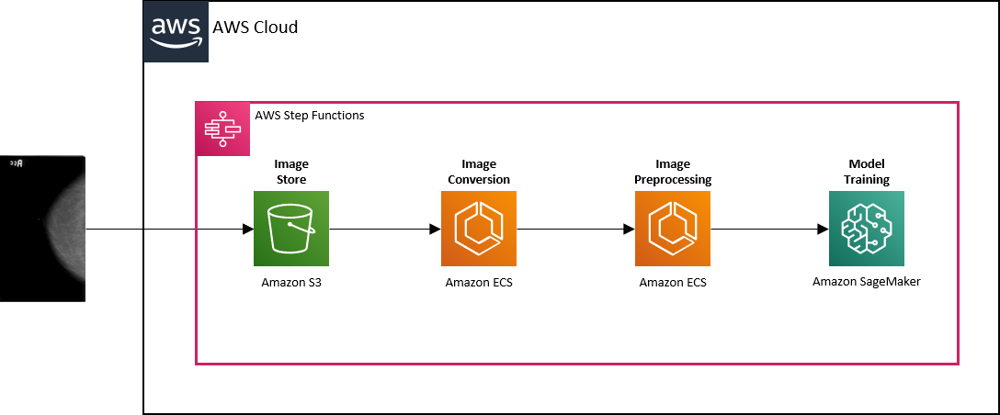

# Mammogram Project

## Getting Started

*Assumes that Terraform, Docker, Python etc. are already installed*

1. Replace AWS profile, region, bucket name and credentials path in `variables.tf`
2. In your terminal, run *'terraform init'* and then *'terraform apply'* (enter *'yes'* when prompted) to deploy the infrastructure into your AWS account
3. (Manual step) Download the required image files from the TCIA using the instructions found [here](https://wiki.cancerimagingarchive.net/display/Public/CBIS-DDSM#1b3530e3e3034786a37019aba53cafba), copying the *'CBIS-DDSM'* folder into a folder named *'data'* in this repo
4. To upload the image data into S3, run *'aws s3 cp data s3://\<your bucket name\>  --recursive'* or use the AWS console
5. Once confirmed that resources are created, run *'aws stepfunctions start-execution --state-machine-arn arn:aws:states:\<your aws region\>:\<your aws account id\>:stateMachine:mammogram-state-machine'* to execute Step Functions workflow
6. Run *'terraform destroy'* to deprovision AWS resources

## High Level Architecture

